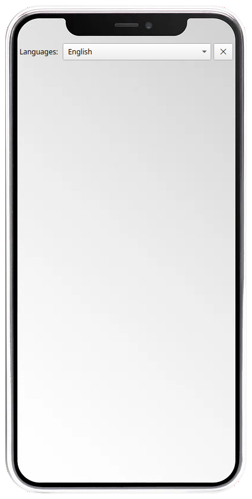

# Transparent window

This is a demonstration of how to create usable non-rectangular (looking) app in python 3 using the following libraries:

- pyqt5

It makes a clever use of QGridLayout to stack a QLabel(with a background image in the shape of app look) and a QFrame with strategically set margins to put widgets on.

```python
from PyQt5.QtCore import *
from PyQt5.QtGui import QPixmap, QMouseEvent
from PyQt5.QtWidgets import (QApplication, QMainWindow, QLabel, QWidget, QGridLayout, QVBoxLayout, QSizePolicy,
                             QToolBar, QPushButton, QComboBox)

class MainWindow(QMainWindow):
    def __init__(self):
        super().__init__()
        self.setWindowTitle("iaconsole")
        # The following values are strategically chosen based on the image 
        self.setGeometry(500, 100, 408, 826)
        self.setWindowOpacity(0.0)
        self.setAttribute(Qt.WA_NoSystemBackground, True)
        self.setAttribute(Qt.WidgetAttribute.WA_TranslucentBackground)
        self.setWindowFlags(
            Qt.WindowType.FramelessWindowHint)
```
You can just drag the window, because there is no OS provided titlebar.

